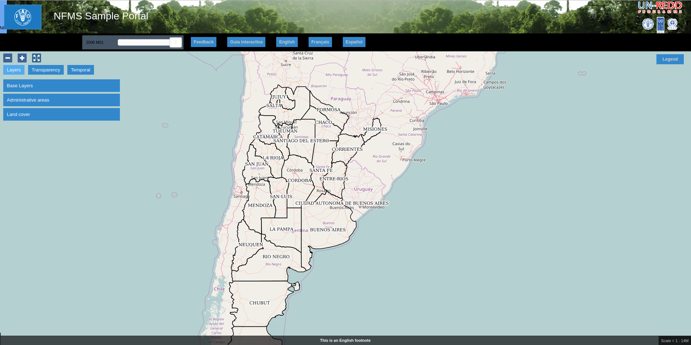

# Configuración inicial

Fecha | Autores |
------|---------|
1 Noviembre 2012    | Stefano Giaccio (Stefano.Giaccio@fao.org)
1 Diciembre 2012    | Oscar Fonts (oscar.fonts@geomati.co)
24 Junio 2013		| Fernando González (fernando.gonzalez@fao.org)
18 Mayo 2017		| Micho García (micho.garcia@geomati.co)

	©2013 FAO Forestry

	Excepto donde quede reflejado de otra manera, la presente documentación se halla bajo licencia : Creative Commons (Creative Commons - Attribution - Share Alike: http://creativecommons.org/licenses/by-sa/3.0/deed.es)

El Portal de NFMS es la aplicación pública de la plataforma, utilizada para la visualización de los recursos cartográficos y estadísticos.

El portal es personalizable a las necesidades de cada país, tanto en su aspecto como en los datos mostrados. La aplicación viene con una configuración por defecto que puede usarse como punto de partida.

En nuestro caso, una vez instalado el portal se obtendrá el siguiente aspecto inicial:

El Portal es accesible en:

  http://localhost:8080/portal/

## Directorio de configuración

Las aplicaciones Geoladris se pueden configurar utilizando un directorio de configuración. Este directorio se puede especificar de diferentes maneras:

* Variable de entorno: `export GEOLADRIS_CONFIG_DIR=/var/geoladris`.
* Propiedad Java: `-DGEOLADRIS_CONF_DIR=/var/geoladris`.
* Parámetro en `web.xml`:

``xml
	<context-param>
		<param-name>GEOLADRIS_CONFIG_DIR</param-name>
		<param-value>/var/geoladris</param-value>
	</context-param>
``

Este directorio deberá contener un subdirectorio por cada aplicación `.war` desplegada.

Por ejemplo, si se han desplegado los paquetes `visor-demo.war` y `visor-bosques.war`, y `GEOLADRIS_CONFIG_DIR` se ha establecido a `var/geoladris`, se utilizarán los siguientes directorios de configuración: `/var/geoladris/visor-demo` y `/var/geoladris/visor-bosques`.

Si alguno de esos directorios no existe o si `GEOLADRIS_CONFIG_DIR` no se ha configurado correctamente, se utilizará el directorio por defecto para esa aplicación concreta: `<directorio_despliegue_app>/WEB-INF/default_config`. Por ejemplo, si se ha desplegado el paquete `visor-demo.war` en `/var/lib/tomcat/webapps`, el directorio de configuración del visor sería `var/lib/tomcat/webapps/visor-demo/WEB-INF/default_config`.

> TODO: Plugins can store configuration in two files:

## portal.properties

> TODO: Private configuration.

Únicamente estas propiedades son visibles para el cliente:

* `title`: Para el _tag_ `<title>` del fichero HTML. Si el título no se especifica aquí, se obtiene de los ficheros `messages.properties`.

> TODO: Good for passwords and sensitive information

El directorio de configuración tiene la siguiente estructura:

	  /var/portal
	  |- indicators/
	  |- portal.properties
	  |- layers.json
	  |- public-conf.json
	  |- messages/
	   \- static/
	        |- overrides.css
	        |- img/
	        \- loc/
	            |- en/
	            │   |- documents/
	            │   |- html/
	            │   \- images/
	            \- es
	                |- documents/
	                |- html/
	                \- images/

Los ficheros principales son:

 * `portal.properties`, contiene parámetros generales del portal, como por ejemplo los idiomas soportados.
 * `layers.json`, probablemente el fichero más importante, contiene la configuración de las capas de datos a mostrar.
 * `messages/` contiene los textos de la aplicación traducidos a varios idiomas.
 * `indicators/`.
 * `static/` contiene recursos estáticos.
 * `static/loc`: recursos clasificados por idioma
 * `static/overrides.css`: última hoja CSS cargada, ideal para sobreescribir otros estilos

### portal.properties

Propiedad | Valor | Descripción |
----------|-------|-------------|
languages | {"en": "English", "fr": "Fran\u00e7ais", "es": "Espa\u00f1ol"} | Elemento JSON con los idiomas que soporta la aplicación
languages.default | en | Idioma por defecto.
db-schema | portal_redd | Nombre del esquema donde están las tablas necesarias para las distintas funcionalidades como estadísticas y feedback
map.centerLonLat | -58,-34 | Longitud y latitud del centro inicial del mapa
map.initialZoomLevel | 5 | Zoom inicial

### layers.json

Define la estructura de capas del proyecto. Consiste en un elemento JSON con cuatro propiedades::

	{
		"default-server" : "http://snmb.ambiente.gob.ar/",
		"wmsLayers" : [],
		"portalLayers" : [],
		"groups" : []
	}

* `default-server` define el servidor que se usará como base en caso de que la URL de las capas no incluyan servidor. Ver atributo `baseUrl` más abajo.

* `wmsLayers` define las capas WMS que tendrá el mapa. El orden en el que estas capas aparecen en el array `wmsLayers` define el orden de las capas en el dibujado del mapa. Cada capa consistirá en un elemento que puede ser de tres tipos. El tipo por defecto es WMS y tiene las siguientes propiedades:

	* id: Identificado de la capa
	* type: Tipo de la capa: WMS, Open Street Map, Google maps, respectivamente "wms", "osm" o "gmaps". Por defecto se tomará type:"wms"
	* visible: Si la capa es utilizada para visualizarse en el mapa o sólo para otras cosas (petición de información, por ejemplo).
	* zIndex: Posición en la pila de dibujado
	* legend: Nombre del fichero imagen con la leyenda de la capa. Estos ficheros se acceden en static/loc/{lang}/images. También es posible poner la cadena de carácteres "auto" y el portal intentará obtener la imagen automáticamente de GeoServer usando la petición GetLegendGraphics de WMS.
	* label: Título de la leyenda
	* sourceLink: URL del proveedor de los datos
	* sourceLabel: Texto con el que presentar el enlace especificado en sourceLink

	En función del tipo de la capa se especificarán además otras propiedades

  * **WMS**:

	* baseUrl: URL del servidor WMS que sirve la capa. Si se especifica una URL sin servidor, por ejemplo "/diss_geoserver/gwc/service/wms", se usará `default-server`.
	* wmsName: Nombre de la capa en el servicio WMS
	* imageFormat: Formato de imagen a utilizar en las llamadas WMS
	* queryType: Protocolo usado para la herramienta de información: "wfs" o "wms". En caso de ser "wfs" los siguientes parámetros son obligatorios: *queryUrl*, *querGeomFieldName*, *queryFieldNames*, *queryFieldAliases*, *queryTimeField* (en caso de ser una capa temporal). En caso de ser "wms" no hay ningún parámetro adicional obligatorio, por lo que una capa que quiera usar WMS para la herramienta de información puede configurarse sólo con: `"queryType":"wms"`. El único requisito para capas con `"queryType":"wms"` es que el servidor codifique en EPSG:4326 la geometría de la respuesta al GetFeatureInfo, en caso contrario el objeto consultado no se podrá localizar en el mapa mediante zoom y resaltado. Si la capa no tiene un parámetro `queryType` la capa no será consultable.
	* queryUrl: URL base a utilizar en la petición de información. Base del servidor WMS o WFS a utilizar (según `queryType`). Si no se especifica se toma `baseUrl`.
	* queryGeomFieldName: Obligatorio en el caso de `"queryType":"wfs"`. El nombre del campo geométrico. Típicamente "geom", "the_geom", "geometry", etc.
	* queryFieldNames: Obligatorio en el caso de `"queryType":"wfs"`. Nombres de los campos que se quieren obtener en la petición de info.
	* queryFieldAliases: Obligatorio en el caso de especificar `queryFieldNames`. Aliases de los campos especificados en `queryFieldNames`.
	* queryTimeFieldName: Obligatorio en el caso de `"queryType":"wfs"` si la capa tiene varias instancias temporales. Sin uso en el caso de `"queryType":"wms"`.
	* queryHighlightBounds: Sólo para el caso `"queryType":"wms"`. Si se desea resaltar solo el rectángulo que encuadra la geometría de los objetos consultados (`true`) o toda la geometría (`false`). Por defecto es `false`. En los casos en los que la geometría es muy grande puede ser conveniente ponerlo a `true` para que el proceso de resaltado sea más rápido.

	Por ejemplo:

~~~

		{
			"wmsLayers" : [
				{
					"id" : "provinces",
					"baseUrl" : "http://snmb.ambiente.gob.ar/geo-server/bosques_umsef_db/wms",
					"wmsName" : "bosques_umsef_db:limites_provinciales",
					"imageFormat" : "image/png8",
					"visible" : true,
					"sourceLink" : "",
					"sourceLabel" : "",
					"queryable" : true
				}
			],
			...
		}
~~~
  * **OpenStreetMap**:

	* osmUrls: lista de las URL de los tiles. Usando ${x}, ${y} y ${z} como variables.

	Por ejemplo:

~~~

		{
			"wmsLayers" : [
				{
					"id" : "openstreetmap",
					"type" : "osm",
					"osmUrls" : [
						"http://a.tile.openstreetmap.org/${z}/${x}/${y}.png",
						"http://b.tile.openstreetmap.org/${z}/${x}/${y}.png",
						"http://c.tile.openstreetmap.org/${z}/${x}/${y}.png"
					]
				}			
			],
			...
		}
~~~    
  * **Google**:

	* gmaps-type: Tipo de capa Google: ROADMAP, SATELLITE, HYBRID o TERRAIN

	Por ejemplo:

~~~

		{
			"wmsLayers" : [
				{
					"id" : "google-maps",
					"type" : "gmaps",
					"gmaps-type" : "SATELLITE"
				}
			],
			...
		}
~~~

* `portalLayers` define las capas que aparecen visibles al usuario. Una `portalLayer` puede contener varias `wmsLayers`. Cada `portalLayer` puede contener los siguientes elementos:

	* id: id de la capa
	* label: Texto con el nombre de la capa a usar en el portal. Si se especifica entre ${ }, se intentará obtener la traducción de los ficheros .properties existentes en el directorio `messages` del  directorio de configuración del portal.
	* infoFile: Nombre del fichero HTML con información sobre la capa. El fichero se accede en static/loc/{lang}/html. En la interfaz gráfica se representa con un botón de información al lado del nombre de la capa
	* infoLink: Url con la información sobre la capa. Igual que infoFile pero especificando una ruta absoluta. infoFile tiene preferencia sobre infoLink, por lo que si se define el primero, infoLink se ignorará.
	* inlineLegendUrl: URL con una imagen pequeña que situar al lado del nombre de la capa en el árbol de capas. También es posible poner la cadena de carácteres "auto" y el portal intentará obtener la imagen automáticamente de GeoServer usando la petición GetLegendGraphics de WMS.
	* active: Si la capa está inicialmente visible o no
	* layers: Array con los identificadores de las `wmsLayers` a las que se accede a través de esta capa
	* timeInstances: Instantes de tiempo en ISO8601 separados por comas
	* timeStyles: Nombres de los estilos a utilizar para cada instancia temporal. Cada estilo se corresponde con aquella instancia temporal que ocupa la misma posición en la lista. Si no se especifica este parámetro se utilizará el estilo por defecto para todos los estilos.
	* date-format: Formato de la fecha para cada capa. Según la librería Moment (http://momentjs.com/docs/#/displaying/). Por ejempo: "DD-MM-YYYY". Por defecto sólo el año (YYYY).
	* feedback: En el caso de que la herramienta de feedback esté instalada, si se quiere o no que la capa aparezca en dicha herramienta para permitir al usuario hacer comentarios sobre la capa.  

	Por ejemplo::

		{
			"wmsLayers" : [
				{
					"id" : "provinces",
					"baseUrl" : "http://snmb.ambiente.gob.ar/geo-server/bosques_umsef_db/wms",
					"wmsName" : "bosques_umsef_db:limites_provinciales",
					"imageFormat" : "image/png8",
					"visible" : true,
					"sourceLink" : "",
					"sourceLabel" : "",
					"queryable" : true
				}
			],
			"portalLayers" : [
				{
					"id" : "provinces",
					"active" : true,
					"infoFile" : "provinces_def.html",
					"label" : "${provinces}",
					"layers" : [ "wms_provinces" ],
					"inlineLegendUrl" : "http://snmb.ambiente.gob.ar/geo-server/bosques_umsef_db/wms?REQUEST=GetLegendGraphic&VERSION=1.0.0&FORMAT=image/png&WIDTH=20&HEIGHT=20&LAYER=bosques_umsef_db:limites_provinciales&TRANSPARENT=true",
					"timeInstances" : "",
					"timeStyles" : "",
					"date-format" : ""
				}
			],
			...
		}

* `groups` define la estructura final de las capas en el árbol de capas de la aplicación. Cada elemento de `groups` contiene:

	* id: id del grupo
	* label: Igual que en `portalLayer`
	* infoFile: Igual que en `portalLayer`
	* infoLink: Igual que en `portalLayer`
	* items. Array de otros grupos, con la misma estructura que este elemento (recursivo).

	Por ejemplo::

		{
			"wmsLayers" : [
				{
					"id" : "provinces",
					"baseUrl" : "http://snmb.ambiente.gob.ar/geo-server/bosques_umsef_db/wms",
					"wmsName" : "bosques_umsef_db:limites_provinciales",
					"imageFormat" : "image/png8",
					"visible" : true,
					"sourceLink" : "",
					"sourceLabel" : "",
					"queryable" : true
				}
			],
			"portalLayers" : [
				{
					"id" : "provinces",
					"active" : true,
					"infoFile" : "provinces_def.html",
					"label" : "${provinces}",
					"layers" : [ "wms_provinces" ],
					"inlineLegendUrl" : "http://snmb.ambiente.gob.ar/geo-server/bosques_umsef_db/wms?REQUEST=GetLegendGraphic&VERSION=1.0.0&FORMAT=image/png&WIDTH=20&HEIGHT=20&LAYER=bosques_umsef_db:limites_provinciales&TRANSPARENT=true",
					"timeInstances" : "",
					"timeStyles" : "",
					"date-format" : ""
				}
			],
			"groups" : [
				{
					"id" : "base",
					"label" : "${base_layers}",
					"infoFile": "base_layers.html",
					"items" : ["provinces"]
				}
			]
		}

## Adaptación del aspecto gráfico

### Cabecera de página

Veamos cómo modificar la imagen de fondo, bandera y título de la cabecera del portal:

Partiendo del PORTAL_CONFIG_DIR (generalmente en /var/portal):

* **Imagen de fondo**: Se encuentra en `static/img/right.jpg`. Sustituir este fichero por otro de igual nombre y formato (jpeg), de 92 píxeles de alto. El ancho puede variar, aunque se recomienda que sea tan ancho como sea posible, hasta los 1920 px de una pantalla de alta definición. Para conseguir un mejor efecto junto con la bandera, se recomienda rellenar de contenido (logotipos, fotografía) la parte más a la derecha de la imagen, hasta un máximo de 500 px. Utilizar un color de fondo liso para el resto de la imagen, que ocupe toda la franja de la izquierda, y que se corresponda con el color de fondo de la bandera.

* **Bandera**: Se encuentra en `static/img/left.jpg`. Sustituir este fichero por otro de igual nombre y formato (jpeg), de 92 píxeles de alto. El ancho puede variar, aunque se recomienda alrededor de los 200 px. Utilizar un color de fondo liso, correspondiente con la parte izquierda de la imagen de fondo, para dar una sensación de continuidad.

* **Título**: Se encuentra definido en los ficheros de mensajes, directorio `messages`, ficheros de nombre `messages_<lang>.properties`. Buscar la propiedad "title" en cada uno de los ficheros de idioma.

### Favicon

Se conoce como *favicon* al icono que se muestra en el navegador en la barra de direcciones. Para personalizar el *favicon*
del portal, basta con copiar la imagen en el directorio `static/img`. El nombre de la imagen sólo puede ser `favicon.ico` o `favicon.png`.

### Estilos predefinidos (CSS)

En ciertos casos se requiere modificar los estilos que vienen predefinidos para OpenLayers, jQuery o cualquier otro. En estos casos,
en lugar de modificar los estilos directamente en el fichero que se encuentra en `/var/tomcat/webapps/portal`, se ha de crear
un nuevo fichero `overrides.css` en el directorio `/var/portal/static/css` que contenga las reglas CSS que se desean modificar.

De esta manera, tendrán preferencia las reglas que se escriban en `overrides.css` frente a cualquier otra que se encuentre en
`/var/tomcat/webapps/portal`.

Además, cuando se despliegue una actualización del portal en Tomcat, el fichero `overrides.css` no se modificará, manteniendo
así la personalización.

### Soporte multiidioma

En los casos anteriores vemos algunas cadenas de texto entre los símbolos `${` y `}`. Estos elementos son sustituidos por mensajes de texto traducidos a cada idioma.

En el directorio `messages` contamos con un fichero `messages.properties` que contiene los mensajes por defecto. Son los textos que se usarán en caso de no encontrar mensajes traducidos a una lengua específica. Los ficheros para los distintos idiomas soportados llevan el código del idioma al final del nombre, según la `[nomenclatura ISO 639-1 de dos letras](http://en.wikipedia.org/wiki/List_of_ISO_639-1_codes)`

## Supuestos prácticos configuración
Se han generado algunos [supuestos prácticos](config_exercices.md) para probar los conocimientos adquiridos sobre la configuración del portal.

