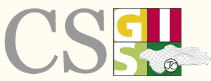

Geoladris existe debido a los esfuerzos de personas como tú.

Hay muchas maneras en las que puedes ayudar con el proyecto Geoladris. Geoladris abarca completamente un modelo de desarrollo de código abierto en la que cualquiera puede participar mediante aportaciones de código, detección de errores, traducción, documentación o lo que se te ocurra.

## Lista de correo

* [Desarrollo](https://groups.google.com/forum/#!forum/geoladris)

## Errores y sugerencias

Para reportar errores o sugerir funcionalidad nueva en Geoladris puedes gastar los issue trackers de GitHub: [core](https://github.com/geoladris/core/issues) y [plugins](https://github.com/geoladris/plugins/issues). Si no tienes claro si pertenece al `core` o a los `plugins`, utiliza el de [plugins](https://github.com/geoladris/plugins/issues).

En nuestros trackers gastamos unas [etiquetas](https://github.com/geoladris/core/labels) específicas (basadas en la idea de Dave Lunny: [Sane GitHub Labels](https://medium.com/@dave_lunny/sane-github-labels-c5d2e6004b63)) para saber el estado, el tipo y la prioridad de la issue. Cuando añadas una nueva issue sólo tienes que incluir una etiqueta `Type: <tipo>`. Del resto nos encargaremos nosotros.

## Formateo del código

Se utiliza el [estilo](https://google.github.io/styleguide/javaguide.html) de Google para formatear el código Java.

Para el código JavaScript se utilizan unas reglas basadas en Airbnb ([ES5](https://www.npmjs.com/package/eslint-config-airbnb-es5)) con ligeras modificaciones. Es posible encontrar los ficheros `.eslintrc` en el repositorio con las definiciones para ejecutar con `eslint`.

## Contribuir cambios

Para incluir correcciones o nuevas funcionalidades, en Geoladris utilizamos [pull requests](https://help.github.com/articles/about-pull-requests/).

## Soporte
Geoladris es software libre, tú puedes hacer uso de las [cuatro libertades del software libre](https://es.wikipedia.org/wiki/Definici%C3%B3n_de_Software_Libre) pero si quieres o necesitas soporte comercial, las organizaciones que se detallan a continuación han participado activamente en el desarrollo de Geoladris.

Ánimo, haz que tu organización también sea partícipe.

