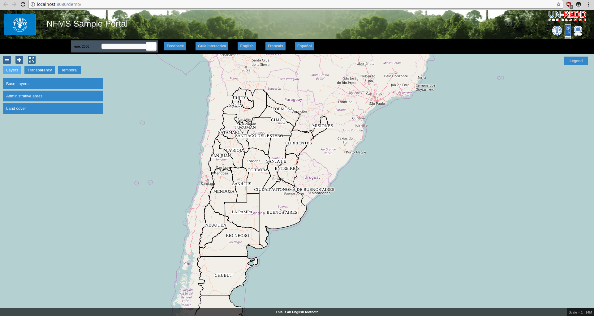
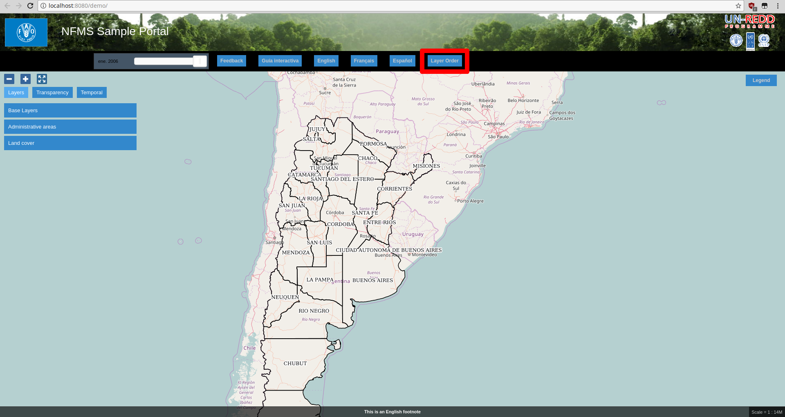

Lo primero que hay que hacer es descargarse la aplicación [demo](https://repo1.maven.org/maven2/com/github/geoladris/apps/demo/7.0.0/demo-7.0.0.war) y desplegarla en Tomcat:

```bash
curl https://repo1.maven.org/maven2/com/github/geoladris/apps/demo/7.0.0/demo-7.0.0.war > $CATALINA_BASE/webapps/demo.war
```

Accedemos al navegador para visualizarla: [http://localhost:8080/demo/](http://localhost:8080/demo/):

<a target="_blank" href="../images/demo.png"></a>

Ahora podemos probar a cambiar algo en el visor. Editamos el fichero `$CATALINA_BASE/webapps/demo/WEB-INF/default_config/public-conf.json` y modificamos lo siguiente:

```json
...
"layer-order" : {
	"_enabled" : true
},
...
```

Acabamos de habilitar el plugin `layer-order`. Si recargamos el visor:

<a target="_blank" href="../images/demo_layer-order.png"></a>

comprobaremos que ha aparecido el plugin `layer-order` en la barra de herramientas.

A partir de aquí podemos seguir [configurando](config.md) la aplicación `demo` o [crear](create.md) una propia.


